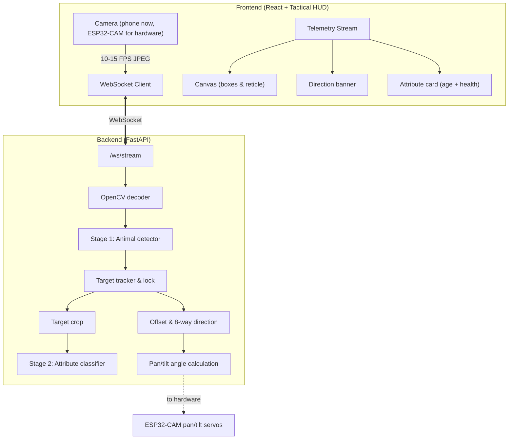

# SentryWing — Deterrence-First Drone & Dock System for Human–Wildlife Conflict Response

> **Autonomous Drone-and-Dock System for Non-Invasive Deterrence and Human-Approved Dart Response in Human–Wildlife Conflict**
> Smart India Hackathon 2026 · Problem Statement SIH26218 · Team Deadlock Defiers

**In one line:** fixed cameras detect an animal, a drone tries non-invasive sound deterrence first, and any dart is fired only after a licensed handler approves (the one exception is an animal entering a people-living area).

> ⚠️ **Please read first.** The 3D renders in our presentation (dart-preparation dock, dual camera payload) are **concept visualizations**, not built hardware. This repository contains the **working software and camera-tracking prototype**. The status table below shows exactly what is built, what is planned for the demo, and what is future scope.

---

## 1. Project status

| Component | Status | Evidence |
|---|---|---|
| Live video streaming + WebSocket backend (FastAPI) | ✅ Built | `backend/` |
| Two-stage AI pipeline (animal detector → attribute classifier) | ✅ Built <!-- FILL: confirm weights included or how to obtain --> | `backend/inference.py`, `notebooks/` |
| Target locking and offset / direction telemetry | ✅ Built | `backend/` |
| Tactical HUD dashboard (React) | ✅ Built | `frontend/` |
| ESP32-CAM pan-tilt rig (internal-round build) | ✅ Built <!-- FILL: confirm --> | `hardware/`, `media/esp32_pan_tilt/` |
| Pre-/post-dart health analysis | ✅ Validated on recorded videos <!-- FILL: confirm --> | `notebooks/`, `media/` |
| Vet-approved dose lookup on dashboard | 🟡 Planned for demo <!-- FILL --> | `data/dose_table_schema.csv` (schema only) |
| Human-approval flow (officer / vet) | 🟡 Planned for demo <!-- FILL --> | — |
| Drone with camera, sound and toy-dart modules | 🟡 Planned for demo (if selected) | — |
| Autonomous dart-preparation dock | 🔵 Concept render only (future scope) | deck slide 3 |
| Dual (visible + thermal) camera payload | 🔵 Concept render only (future scope) | deck slide 3 |
| Geofenced boundaries + autonomous override | 🔵 Future scope | — |

✅ built and tested · 🟡 planned for the hackathon demo · 🔵 future scope

---

## 2. Demo

<!-- FILL: add a short (30–60 s), steady, landscape demo clip (YouTube unlisted link or a GIF in /media) -->

| Screenshot | What it shows |
|---|---|
| `media/screenshots/detection.png` | Correct species detection with confidence |
| `media/screenshots/tracking_hud.png` | Target lock, offset and direction banner |
| `media/esp32_pan_tilt/` | ESP32-CAM pan-tilt rig following a target |

---

## 3. How it works



**Safety design (matches the presentation):**
1. Sound deterrence is tried first, on every detection.
2. A licensed handler (forest officer / vet) approves before any dart action.
3. Automatic override applies only when the animal enters a people-living area.
4. The hackathon demo uses a **foam-model animal and a toy dart only**. No real drug or dart is used.
5. Real vet-approved dose values are **not published** here. `data/dose_table_schema.csv` shows the structure with illustrative placeholder numbers.

---

## 4. Models

| Model | Purpose | Data source | Status | Result |
|---|---|---|---|---|
| Model 1 | Animal type / species / attributes | <!-- FILL: e.g. Kaggle / Roboflow / Hugging Face + our images --> | <!-- FILL --> | <!-- FILL: held-out accuracy --> |
| Model 2 | Pre-dart health analysis | Our stress/health media (Dataset 4) | <!-- FILL --> | <!-- FILL --> |
| Model 3 | Target-zone (muscle area) identification | Annotated images (Dataset 2) | <!-- FILL --> | <!-- FILL --> |
| Model 4 | Post-dart breath-rate analysis | Our chest/flank videos (Dataset 3) | <!-- FILL --> | <!-- FILL --> |
| Model 5 | Negative class (non-target animals, people) | <!-- FILL --> | <!-- FILL --> | <!-- FILL --> |

**Simulation mode:** if no weights are present in `backend/models/`, the backend runs a **stub simulator** that generates synthetic animal trajectories so the pipeline can be tested end to end. The dashboard shows a **SIMULATION MODE** banner in this state. <!-- FILL: confirm banner exists, or add it -->

**Known limitations (honest notes):**
- <!-- FILL example: On an external test image, a tiger was labelled "cheetah" with 0.66 confidence. We are retraining on more data and adding a confidence threshold so uncertain detections are shown as "uncertain". -->
- Weight and age are **approximate visual estimates**, not measurements. Final dosing in the full system comes from a vet-approved lookup by species and weight class.
- The ESP32-CAM Wi-Fi stream can drop frames. <!-- FILL if true -->

---

## 5. Hardware prototype (ESP32-CAM pan-tilt)

<!-- FILL: 3–5 lines. Include the parts list (ESP32-CAM, servos, bracket), wiring photo, where the firmware lives, and what was tested. -->

---

## 6. Quickstart

### Backend
```bash
cd backend
pip install -r requirements.txt
python -m uvicorn main:app --host 0.0.0.0 --port 8000
```

### Frontend
```bash
cd frontend
npm install
npm run dev -- --host
```
Vite serves over HTTPS. Open the network URL on your phone (same Wi-Fi), accept the local certificate warning, and allow camera access.

### Model weights
Place `detector.onnx` / `detector.pt` and `attribute.onnx` / `attribute.pt` in `backend/models/`, then click **RELOAD MODELS** or call `POST /api/models/reload`.
<!-- FILL: link to weights (GitHub Release / Drive) if they are not in the repo -->

---

## 7. Roadmap (mirrors the presentation)

- **Prototype scope (if selected):** working drone with camera, sound and toy-dart modules; species detection and dose display on a live dashboard; human-approved launch and lost-target search; health analysis shown on validation videos.
- **Future scope:** autonomous dart-preparation dock and dual (visible + thermal) camera; multi-species response and live-animal field validation; Forest Department integration, geofenced override and wider rollout; regulatory approvals (drone, night-flight, wildlife permits).

---

## 8. Repository layout

```
backend/     FastAPI server, inference, tracker
bridge/      <!-- FILL: one line on what this does -->
frontend/    React + Vite dashboard
hardware/    ESP32-CAM pan-tilt firmware and wiring notes
notebooks/   training and evaluation notebooks
data/        dataset descriptions and dose-table schema (no real doses)
media/       screenshots, demo clip, hardware photos
docs/        architecture diagram, link to the presentation
```

## 9. Team, license, contact

**Team Deadlock Defiers** — SIH 2026. <!-- FILL: names/roles if you want -->
License: <!-- FILL: e.g. MIT -->
Contact: <!-- FILL -->
